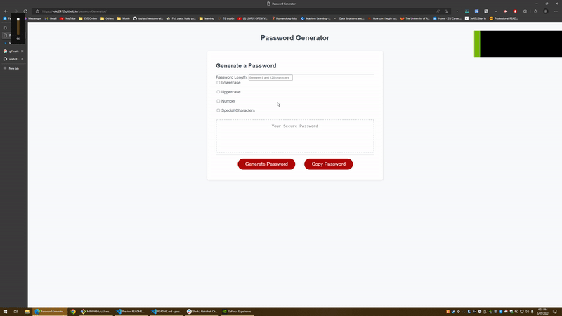

# <Password-Generator>

## Password Generator

## Description

This project is created for the purpose of generating a strong password with popular criteria from most of the website nowadays.
I created this project so that I don't have to think about my password everytime I want to make a new account for anywebsite. Just use keychain and this :).

## Usage

1. Just enter your password length, please make sure it needs to be at least 8 characters and not more than 128 characters.
2. Then, please choose at least 1 criteria for your password. It will display invalid option if you did not select any criteria or choose wrong password length.
3. The copy button can be used to quickly copy the generated password to clipboard.

## Demo

## Technologies

## Features

1. It uses **checkboxes** and **inputBox** instead of **prompt** and **confirm** for smoother UI and better user experience.
2. It uses **window.crypto** method to generate random password instead of **math.random** for improved security. Since **math.random** can be cracked easily at the time of the password was created.
3. It displays where the user has input invalid value or option by showing a red/orange border around that area. That border should disappear after 3 second.
4. The copy button is used to quickly copy the generated password.

## License
	MIT License

	Copyright (c) 2022 Chi Hieu Nguyen

	Permission is hereby granted, free of charge, to any person obtaining a copy
	of this software and associated documentation files (the "Software"), to deal
	in the Software without restriction, including without limitation the rights
	to use, copy, modify, merge, publish, distribute, sublicense, and/or sell
	copies of the Software, and to permit persons to whom the Software is
	furnished to do so, subject to the following conditions:

	The above copyright notice and this permission notice shall be included in all
	copies or substantial portions of the Software.

	THE SOFTWARE IS PROVIDED "AS IS", WITHOUT WARRANTY OF ANY KIND, EXPRESS OR
	IMPLIED, INCLUDING BUT NOT LIMITED TO THE WARRANTIES OF MERCHANTABILITY,
	FITNESS FOR A PARTICULAR PURPOSE AND NONINFRINGEMENT. IN NO EVENT SHALL THE
	AUTHORS OR COPYRIGHT HOLDERS BE LIABLE FOR ANY CLAIM, DAMAGES OR OTHER
	LIABILITY, WHETHER IN AN ACTION OF CONTRACT, TORT OR OTHERWISE, ARISING FROM,
	OUT OF OR IN CONNECTION WITH THE SOFTWARE OR THE USE OR OTHER DEALINGS IN THE
	SOFTWARE.
## Contact Information
void2412@gmail.com

## Credits
Chi Hieu Nguyen